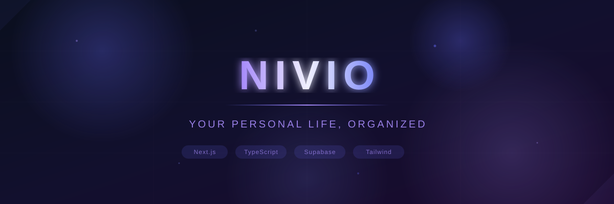

<p align="center">
  
</p>

<p align="center">
  <strong>A private, all-in-one personal organizer — tasks, expenses, journal &amp; important dates in one secure place.</strong>
</p>

<p align="center">
  <a href="#-features"></a>
  
  
</p>

---

## 🛠️ Tech Stack

<table>
  <tr>
    <td align="center" width="140">
      <br/>
      <sub><b>Framework</b></sub>
    </td>
    <td align="center" width="140">
      <br/>
      <sub><b>Language</b></sub>
    </td>
    <td align="center" width="140">
      <br/>
      <sub><b>Styling</b></sub>
    </td>
    <td align="center" width="140">
      <br/>
      <sub><b>Database & Auth</b></sub>
    </td>
    <td align="center" width="140">
      <br/>
      <sub><b>Validation</b></sub>
    </td>
    <td align="center" width="140">
      <br/>
      <sub><b>Icons</b></sub>
    </td>
  </tr>
</table>

---

## ✨ Features

| Feature | Description |
|---------|-------------|
| 📊 **Personal Dashboard** | A quick-glance overview of your day — remaining to-dos, upcoming dates, recent journal entries, and a spending summary. |
| ✅ **Task Management** | Create, complete, and organize your to-do list with a clean, fast interface. |
| 💰 **Expense Tracking** | Log expenses, assign categories, and visualize spending trends over the last 7 days. |
| 📔 **Encrypted Journal** | Write down thoughts and daily reflections with **AES-256-GCM client-side encryption** — your entries are unreadable even in the database. |
| 📅 **Important Dates** | Never miss a birthday, deadline, meeting, or milestone. |
| 🔐 **Secure Auth** | Email/password authentication with email verification via Supabase Auth. |
| 🛡️ **Row Level Security** | Postgres RLS policies ensure every row is tied to `auth.uid()` — your data is strictly private. |
| 🌗 **Theme Support** | Light and dark mode with a theme context provider. |

---

## 🏗️ Project Structure

```
nivio/
├── app/                      # Next.js 14 App Router (routes, pages, layouts)
│   ├── api/health/           # Health check API route
│   ├── dashboard/            # Authenticated dashboard views (dates, diary, expenses, settings, tasks)
│   ├── forgot-password/      # Password reset flow
│   ├── login/                # Authentication login page
│   ├── signup/               # User registration page
│   ├── verify-email/         # Email verification notice
│   ├── layout.tsx            # Root HTML layout & fonts
│   └── page.tsx              # Landing page entry point
├── components/               # Component library with barrel exports
│   ├── common/               # Cross-cutting components (ErrorBoundary)
│   ├── dashboard/            # Dashboard widgets (Sidebar, Charts, TopNav)
│   ├── landing/              # Landing sections (NivioLanding, Hero, Features, CTA)
│   ├── layout/               # Global navigation & footer
│   ├── ui/                   # Design system primitives (Button, Modal, Toast, Skeleton)
│   └── index.ts              # Unified components barrel export
├── context/                  # React context providers (AuthContext, ThemeContext) & index.ts
├── hooks/                    # Custom React hooks (useAuth, useTheme) & index.ts
├── lib/                      # Utilities, crypto & validation schemas
│   ├── authErrors.ts         # Auth error mapping
│   ├── journalCrypto.ts      # Zero-knowledge AES-256-GCM encryption
│   └── utils.ts              # Styling & formatting utilities
├── public/                   # Static assets (banner.svg, journal-hero.mp4)
├── services/                 # Domain data services
│   ├── authService.ts        # Supabase auth operations
│   ├── userService.ts        # Profile & encryption key store
│   ├── todoService.ts        # Task management CRUD
│   ├── expenseService.ts     # Expense logging & analytics
│   ├── dateService.ts        # Important dates & reminders
│   ├── diaryService.ts       # Encrypted journal operations
│   ├── personalService.ts    # Unified facade (backward-compatible)
│   └── index.ts              # Central services barrel export
├── supabase/                 # Supabase client, schema & migrations
│   ├── client.ts             # Browser Supabase client
│   ├── schema.sql            # Postgres tables & RLS policies
│   └── migrations/           # Versioned migrations
├── middleware.ts              # HTTP security headers middleware
├── types/                    # Shared TypeScript models & interfaces
├── next.config.mjs           # Next.js configuration
├── tailwind.config.ts        # Tailwind CSS configuration
└── tsconfig.json             # TypeScript configuration
```

---

## 🔒 Security Architecture

Nivio takes a **zero-trust** approach to user data:

- **Client-Side Encryption** — Journal entries are encrypted in the browser using **AES-256-GCM** before they ever leave your device. The encryption key is derived from your credentials via **PBKDF2-SHA-256** (210,000 iterations) and wrapped with a password-derived key. Even database administrators cannot read your journal.
- **Row Level Security** — All Supabase tables enforce Postgres RLS policies. Every query is scoped to `auth.uid()`, making it impossible for one user to access another's data.
- **Security Headers** — The Next.js middleware applies a strict set of HTTP security headers on every response.

---

## 🚀 Getting Started

### Prerequisites

- **Node.js** 18+ and **npm**
- A [Supabase](https://supabase.com/) project

### 1. Clone the repository

```bash
git clone https://github.com/your-username/nivio.git
cd nivio
```

### 2. Set up the database

Open the **Supabase SQL Editor** and run the schema file:

```
supabase/schema.sql
```

This creates all tables (`users`, `expenses`, `todos`, `dates`, `diary`), triggers, and RLS policies.

### 3. Configure authentication

In your Supabase dashboard:
1. Enable **Email/Password** auth
2. Set the **Site URL** to `http://localhost:3000`
3. Add `http://localhost:3000/dashboard` to **Redirect URLs**

### 4. Set environment variables

```bash
cp .env.example .env.local
```

Fill in your credentials:

```env
NEXT_PUBLIC_SUPABASE_URL=https://your-project.supabase.co
NEXT_PUBLIC_SUPABASE_ANON_KEY=your_supabase_anon_key
NEXT_PUBLIC_APP_URL=http://localhost:3000
```

### 5. Install & run

```bash
npm install
npm run dev
```

Open [http://localhost:3000](http://localhost:3000) — you're all set! 🎉

---

## 📝 License

This project is licensed under the [MIT License](LICENSE).

---

<p align="center">
  <sub>Built with ☕ and TypeScript</sub>
</p>